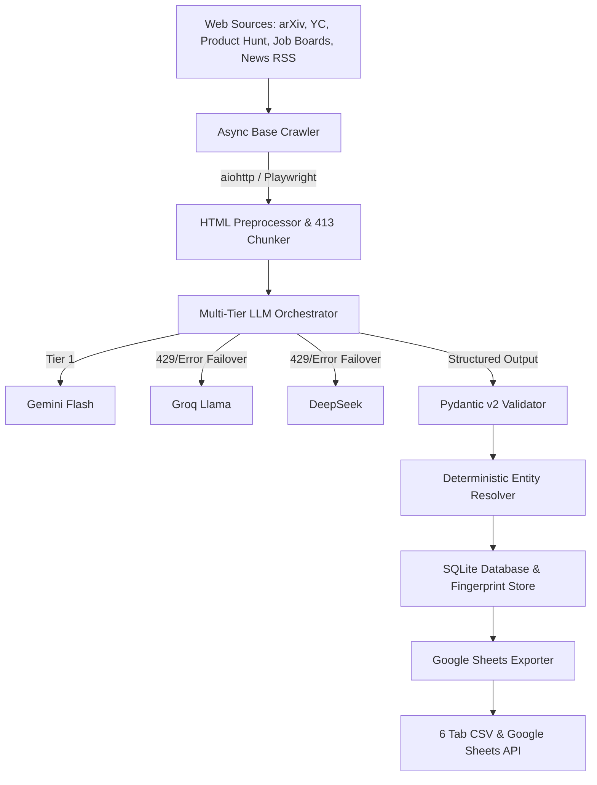

# AI Intelligence Data Ingestion & Enrichment Pipeline

Production-oriented asynchronous data ingestion, enrichment, entity resolution, and export pipeline in Python built to process AI ecosystem intelligence from legitimate web sources.

---

## 1. Project Overview
This application automates the end-to-end collection and processing of AI ecosystem data across 5 entity types: **Startups**, **Products**, **Research Papers**, **Jobs**, and **News**. Designed with high concurrency, strict data integrity constraints, multi-tier LLM fallback failover, 413 chunking protection, 429 rate limit backoff, deterministic entity resolution, and multi-format Google Sheets export capabilities.

---

## 2. Problem Statement
Aggregating structured intelligence on the AI landscape presents major challenges:
- High variability in web schemas across research archives, job boards, and news outlets.
- Frequent 413 Payload Too Large and 429 Rate Limit responses from LLM extraction APIs.
- Inconsistent entity name variations (e.g. "OpenAI", "Open AI, Inc.") leading to duplicate records.
- Stale jobs and outdated news polluting analytics.
- Risk of LLM hallucination introducing unverified claims.

This pipeline solves these problems through an asynchronous, fault-tolerant ingestion engine with deterministic deduplication, strict Pydantic schema validation, and 24-hour freshness enforcement.

---

## 3. System Architecture


---

## 4. Features
- **Asynchronous Crawling**: High-concurrency network I/O with `aiohttp` and `Playwright Async` fallback.
- **5 Entity Pipelines**: Specialized collection for Startups, Products, Research Papers, Jobs, and News.
- **Strict Data Integrity**: Traceable `source.url` for every record; null/empty fallback rather than LLM hallucination.
- **GitHub Star Enrichment**: Fetches real-time GitHub star counts via GitHub REST API without relying on LLM estimation.
- **24-Hour Freshness Window**: Strict filters for jobs and news published within the previous 24 hours.
- **Multi-Tier LLM Fallback Chain**: Tiered failover (`Gemini Flash` → `Groq Llama` → `DeepSeek`).
- **413 Payload Protection**: HTML tag decomposition and semantic text chunking.
- **429 Rate Limit Resilience**: Exponential backoff with random jitter and `Retry-After` header inspection.
- **Deterministic Entity Resolution**: Normalizes whitespace, case, punctuation, and company suffixes against a 50-item AI seed list.
- **6-Tab Google Sheets Export**: Generates local CSVs and syncs directly to Google Sheets API tabs (`Startups`, `Products`, `Research Papers`, `Jobs`, `News`, `Entity Mapping Log`).

---

## 5. Technology Stack
- **Language**: Python 3.11+
- **Asynchronous I/O**: `asyncio`, `aiohttp`, `Playwright Async`
- **Parsing & Scraping**: `BeautifulSoup4`, `lxml`
- **Data Validation**: `Pydantic v2`, `pydantic-settings`
- **LLM APIs**: `google-generativeai`, `groq`, `httpx`
- **Google Sheets API**: `google-api-python-client`, `google-auth`
- **Storage**: `SQLite3`, `CSV`
- **Testing**: `pytest`, `pytest-asyncio`

---

## 6. Project Structure
```
AI_Engineer_Demo_Task/
├── src/
│   ├── crawler/                  # Async web crawler & entity scrapers
│   │   ├── base_crawler.py
│   │   ├── paper_scraper.py
│   │   ├── startup_scraper.py
│   │   ├── product_scraper.py
│   │   ├── job_scraper.py
│   │   └── news_scraper.py
│   ├── llm/                      # Multi-tier LLM fallback & resilience
│   │   ├── base_provider.py
│   │   ├── gemini_provider.py
│   │   ├── groq_provider.py
│   │   ├── deepseek_provider.py
│   │   ├── chunker.py
│   │   ├── retry.py
│   │   └── orchestrator.py
│   ├── entity_resolution/        # Deterministic entity name resolver
│   │   └── resolver.py
│   ├── storage/                  # SQLite storage & Google Sheets exporter
│   │   ├── base_storage.py
│   │   ├── sqlite_storage.py
│   │   └── sheets_exporter.py
│   ├── models/                   # Pydantic v2 canonical JSON schemas
│   │   └── schemas.py
│   ├── utils/                    # Date parsing, fingerprinting, logging
│   │   ├── date_parser.py
│   │   ├── fingerprint.py
│   │   └── logger.py
│   ├── config.py                 # Pydantic BaseSettings config
│   └── main.py                   # Pipeline entry point & CLI
├── data/
│   └── output/                   # Local CSV output directory
├── tests/                        # Comprehensive unit & integration tests
├── .env.example
├── .env
├── requirements.txt
├── README.md
└── architecture.md               # 500k+ record scaling architecture guide
```

---

## 7. Installation

1. **Clone/Navigate to project**:
   ```bash
   cd C:\Users\HP\.gemini\antigravity\scratch\AI_Engineer_Demo_Task
   ```

2. **Create & Activate Virtual Environment**:
   ```bash
   uv venv
   .venv\Scripts\activate
   ```

3. **Install Dependencies**:
   ```bash
   uv pip install -r requirements.txt
   ```

---

## 8. Environment Variables
Copy `.env.example` to `.env` and fill in optional API keys:
```env
GEMINI_API_KEY=your_gemini_key
GROQ_API_KEY=your_groq_key
DEEPSEEK_API_KEY=your_deepseek_key
GITHUB_TOKEN=your_github_token
GOOGLE_SHEETS_CREDENTIALS_FILE=credentials.json
GOOGLE_SHEET_ID=your_sheet_id
CONCURRENCY_LIMIT=10
DEFAULT_RECORD_LIMIT=10
FRESHNESS_HOURS=24
```

---

## 9. How to Run

### Run Demo Pipeline (Default 10 records/category):
```bash
uv run python src/main.py
```

### Run Custom Limit Execution (e.g. 50 records/category):
```bash
uv run python src/main.py --limit 50 --freshness 24
```

---

## 10. How to Run Tests
Execute the automated test suite with `pytest`:
```bash
uv run pytest
```

---

## 11. Data Sources
- **Research Papers**: arXiv API (`http://export.arxiv.org/api/query`), Papers With Code
- **Startups**: Y Combinator Public Directory (`https://www.ycombinator.com/companies`)
- **Products**: Product Hunt RSS (`https://www.producthunt.com/feed`)
- **Jobs (5 Boards)**: RemoteOK AI, WeWorkRemotely AI, Jobspresso AI, AI-Jobs.net, NoDesk AI
- **News (5 Sources)**: TechCrunch AI, VentureBeat AI, MIT Tech Review AI, HackerNews AI, AI News Daily

---

## 12. LLM Fallback Strategy
```
[Input HTML/Text]
       │
       ▼
1. Gemini Flash API ────────► Success? ──► [Return Structured JSON]
       │ (429 Rate Limit / Error / Key Missing)
       ▼
2. Groq Llama API ──────────► Success? ──► [Return Structured JSON]
       │ (429 Rate Limit / Error / Key Missing)
       ▼
3. DeepSeek API ────────────► Success? ──► [Return Structured JSON]
       │ (All LLM providers unavailable/failed)
       ▼
4. Fallback Rule Engine ────► [Preserve Source Text Data Integrity]
```

---

## 13. 413 Payload Too Large Handling
The `HTMLChunker` class strips `<script>`, `<style>`, `<nav>`, `<header>`, and `<footer>` tags using BeautifulSoup. Text is split into semantic paragraphs up to `MAX_CHUNK_SIZE` (4,000 characters) before sending to LLM APIs, completely preventing 413 HTTP errors.

---

## 14. 429 Rate Limit Handling
The `execute_with_retry` wrapper calculates exponential backoff:
$$\text{delay} = \text{factor}^{\text{attempt}} + \text{jitter}$$
If a `Retry-After` header is present, the backoff automatically respects it. If retries are exhausted, control seamlessly transfers to the next provider in the LLM fallback chain.

---

## 15. Entity Resolution Strategy
Company names undergo normalization:
- Lowercasing and strip punctuation.
- Stripping legal entity suffixes (`Inc.`, `LLC`, `Corp`, `Ltd`, `GmbH`, `PBC`).
- Exact & tight matching against a 50-item seed database (`OpenAI`, `Anthropic`, `Mistral AI`, etc.).
- Output recorded in `6_entity_mapping_log.csv`.

---

## 16. Scalability Strategy
Designed to scale from 1,000 to 500,000+ records via:
- Non-blocking `asyncio` I/O loops.
- Bounded concurrency with `asyncio.Semaphore`.
- Checkpointed SQLite state preventing redundant reprocessing.
- Queue-based worker pattern for distributed deployment.

---

## 17. Freshness Strategy
All job and news entries pass through `is_within_last_24_hours()`. Dates in ISO, relative formats ("2 hours ago"), or standard strings are converted to UTC datetime. Items outside the 24-hour window are discarded before storage.

---

## 18. Data Integrity Rules
- No hallucinated data: All output fields require source evidence.
- Traceability: Every entity includes `source.name`, `source.url`, and `collectedAt`.
- GitHub Stars: Derived from GitHub REST API, never estimated by LLMs.
- Missing values default to `null`/empty.

---

## 19. Limitations
- Public RSS feeds restrict pagination depth for historical dates (addressed by 24h freshness rule).
- Cloudflare JS challenges on certain sites require Playwright Async fallback mode.

---

## 20. Future Improvements
- Migration from SQLite to PostgreSQL with PgVector for semantic similarity search.
- Neo4j graph storage for paper-repository-author relationships.
- Distributed Celery/Redis queue for scaling worker nodes across multiple servers.
