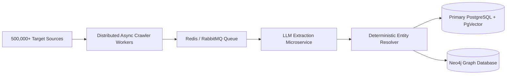
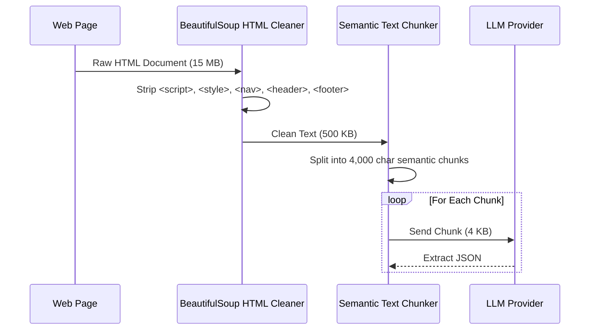

# AI Intelligence Data Ingestion & Enrichment Pipeline - Architecture Document

This architecture document presents the technical design for scaling the **AI Intelligence Data Ingestion and Enrichment Pipeline** from a local demo prototype to a enterprise system handling **500,000+ records**.

---

## 1. Executive Summary & Core Principles
The pipeline architecture decouples data ingestion, HTML text processing, LLM extraction, entity resolution, and persistence into asynchronous, stateless microservices.

---

## 2. Horizontal Scaling to 500,000+ Records
To process 500,000+ records without memory bloat or bottlenecking:

1. **Distributed Queue Architecture**: Replace local `asyncio.gather` with distributed task queues (Celery / Redis / Kafka).
2. **Stateless Crawler Nodes**: Crawler workers publish raw scraped payloads to Kafka topics (`raw-scraped-pages`).
3. **Stream Processing Workers**: LLM worker pools pull messages from Kafka, process chunks, and emit structured JSON records to downstream queues (`structured-entities`).
4. **Idempotent Ingestion**: Database writes use `ON CONFLICT (fingerprint) DO NOTHING` to ensure zero redundant disk writes.
5. **Memory-Constrained Chunk Processing**: Streams payloads rather than keeping entire raw pages in memory.

---

## 3. 413 Payload Too Large Handling Architecture
LLM API gateways enforce strict payload size limits (e.g. 4MB/call).

---

## 4. 429 Rate Limit Handling & Fallback Chain Architecture
Resilience against rate limiting and API quotas:

1. **Exponential Backoff with Jitter**:
   $$\text{delay} = \text{backoff\_factor}^{\text{attempt}} + \text{random}(0.1, 0.5)$$
2. **Retry-After Header Inspection**: Reads HTTP `Retry-After` headers to pause requests dynamically.
3. **Multi-Tier Provider Failover**:
   - Primary: **Gemini Flash** (High throughput, low latency)
   - Secondary: **Groq Llama** (Ultra-fast inference failover)
   - Tertiary: **DeepSeek** (Cost-effective batch failover)
   - Emergency: Deterministic rule-based extraction keeping data intact.

---

## 5. 24-Hour Freshness Enforcement
For Jobs and News entities:
- **Timestamp Normalization**: Normalizes relative strings ("3 hours ago", "yesterday"), ISO-8601, and RFC-2822 timestamps into standard UTC.
- **Strict Boundary Check**: Items with $T_{\text{pub}} < T_{\text{now}} - 24\text{h}$ are immediately filtered out.
- **Heuristic Fallback**: For sources missing publication dates, the pipeline checks HTTP `Last-Modified` headers and compares link hashes against the previous crawl state.

---

## 6. Distributed Duplicate Prevention
To prevent duplicate processing across $N$ distributed crawler nodes:
- **Canonical Fingerprinting**: SHA-256 hash computed from:
  $$\text{Fingerprint} = \text{SHA256}(\text{NormalizedURL} \parallel \text{CanonicalEntityName} \parallel \text{PublishedDate})$$
- **Distributed Redis Bloom Filter**: Crawler nodes query a shared Redis Bloom Filter ($O(1)$ lookup time) before fetching URLs.

---

## 7. Primary Database Migration Strategy
For 500,000+ records, migrate from SQLite to **PostgreSQL**:
- **Partitioned Tables**: Partition `entities` table by `record_type` and `created_at` (monthly partitions).
- **JSONB Indexes**: GIN indexing on `payload` column for instant JSON key queries.
- **Connection Pooling**: PgBouncer managing database connections across hundreds of worker nodes.

---

## 8. Vector & Graph Storage Strategy
Complex entity relationships require specialized storage:
- **Vector Search (PgVector / Qdrant)**: Embed research paper abstracts and news content using `text-embedding-004` to enable semantic search, research topic clustering, and duplicate detection.
- **Graph Storage (Neo4j)**: Model connections between:
  - `(STARTUP)-[:LAUNCHED]->(PRODUCT)`
  - `(STARTUP)-[:POSTED]->(JOB)`
  - `(RESEARCH_PAPER)-[:HAS_REPO]->(GITHUB_REPO)`
  - `(STARTUP)-[:AUTHORED]->(RESEARCH_PAPER)`

---

## 9. Async Crawler Architecture
- Built on Python `asyncio` event loop.
- **Connection Management**: Persistent `aiohttp.ClientSession` connection pools with keep-alive.
- **Playwright Async Fallback**: Headless Chromium instance invoked only when HTTP 403/429 Cloudflare anti-bot barriers are encountered.
- **Graceful Error Isolation**: Page fetch failures are logged without stopping the main event loop.

---

## 10. Entity Resolution Architecture
Deterministic rule-based name resolution:
1. **Case & Punctuation Stripping**: Converts `"Open AI, Inc."` to `"open ai inc"`.
2. **Suffix Stripping**: Removes legal designators (`Inc`, `LLC`, `Corp`, `Ltd`, `GmbH`, `PBC`).
3. **Seed Database Lookup**: Compares against 50 canonical AI entity names (`OpenAI`, `Anthropic`, `Mistral AI`, etc.).
4. **Resolution Audit Trail**: Every match outputs an audit record to `6_entity_mapping_log.csv`.
